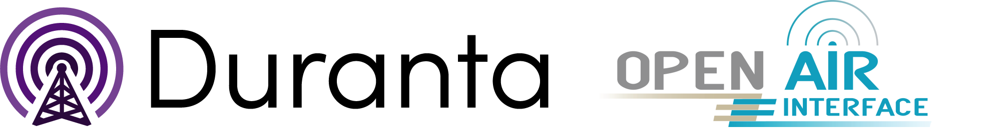

<!-- SPDX-License-Identifier: CC-BY-4.0 -->

# Duranta Governance

<h1 align="center">
    
    
</h1>

Duranta is an open, research-grade RAN + UE reference stack. It is Built on [
OpenAirInterface RAN and UE software stack](https://openairinterface.org/ran/) 
and hosted by LF Networking.

This repository contains governance documents for
[LFN Duranta project](https://lfnetworking.org/projects/duranta/).

Duranta Technical Steering Committee (TSC) [meetings](https://lf-networking.atlassian.net/wiki/spaces/Duranta/pages/600473601/Getting+Started+with+Duranta)

## About OAI RAN and UE Software Stack

OAI RAN delivers and maintains an open-source cellular wireless software stack 
for 5G and future networking technologies. It supports simulation, prototyping, 
and end-to-end deployments on Commercial-Off-The-Shelf (COTS) hardware. Built 
for research and experimentation, it provides standard-compliant interfaces and 
is released under the Collaborative Standards Software License (CSSL).

The supported features and capabilities can be found in the 
[openairinterface5g](https://github.com/duranta-project/openairinterface5g/blob/develop/doc/FEATURE_SET.md) repository. 

## Licenses 

The openairinterface5g source code is distributed under CSSL v1.0.
Some files, such as for orchestration, are distributed under MIT license.
Documentation is distributed under Creative Commons Attribution 4.0 
International license.

Some files may have a different license you can read about the exceptions in the
openairinterface5g repository 
[NOTICE](https://github.com/duranta-project/openairinterface5g/blob/develop/NOTICE) file.

All the files without an explicit copyright header
have an implicit "Copyright of OpenAirInterface Authors".

In [openairinterface5g](https://github.com/duranta-project/openairinterface5g/tree/develop/LICENSES) repository you can find the list of licenses.

## Project Technical Charter

We recommend you to read the project technical charter before making your first 
contribution. The Charter sets forth the responsibilities and procedures for 
technical contribution to, and oversight of, the Duranta, which has been 
established as Duranta a Series of LF Projects, LLC (the “Project”). LF 
Projects, LLC (“LF Projects”) is a Delaware series limited liability company. 
All contributors (including committers, maintainers, and other technical 
positions) and other participants in the Project (collectively,"Collaborators") 
must comply with the terms of the Charter.

## Contributor License Agreement

The Duranta project requires that all contributions of ideas, code, or 
documentation to Duranta projects sign a Contributor License Agreement (CLA).
The purpose of this agreement is to clearly define the terms under which 
intellectual property is contributed to Duranta. It also enables the us to 
protect the project in the event of any legal dispute regarding the software in 
the future.

The Individuals contributing to the project should sign an Individual 
Contribution License Agreement (ICLA). Corporations whose employees contribute 
to Duranta project, should sign a Corporate Contributor License Agreement (
CCLA) and all their employees to contribute to the project.

The CLA is managed using the Linux Foundation Easy CLA tool, to know more about the process [please read this document](./docs/easy_cla_process.md).  
