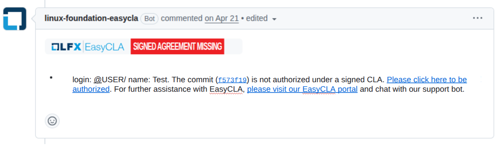
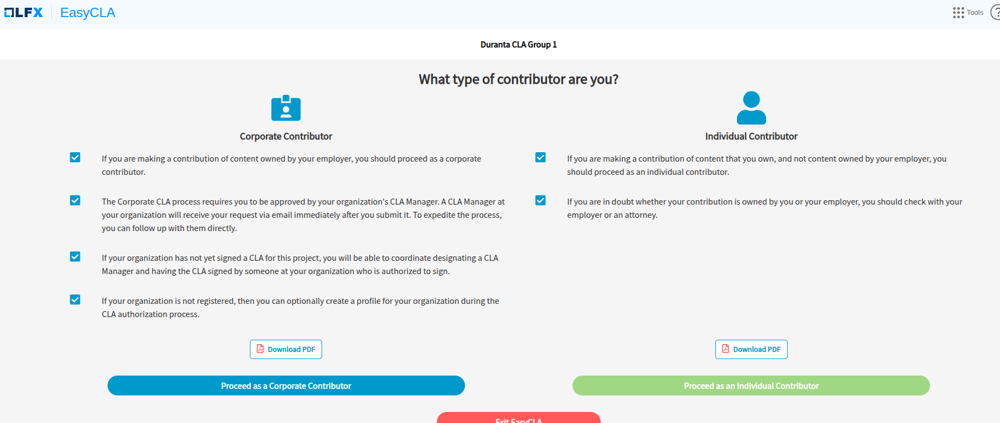
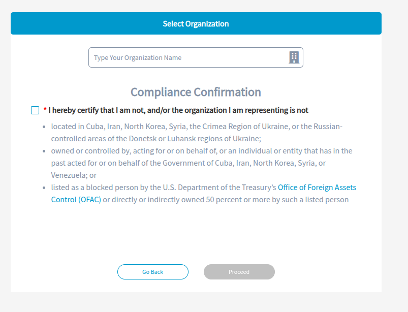

# Easy CLA: Signing of Contributor License Agreement

The CLA is managed using the [Linux Foundation Easy CLA
tool](https://github.com/linuxfoundation/easycla).  The contributors can sign
the CLA before doing the contribution or after doing the contribution.

Though to sign the CLA you have to create a [LFX
account](https://lfx.linuxfoundation.org/tools/individual-dashboard/).  For the
companies the LFX account helps you manage the list of approved contributors
from the company.

**Very important Note**: Offline signing of PDF version of CLA is not
recommended because you will still need to mention your/your employees
email-address, email domain or Github ID so that their pull request can pass
the Easy CLA test, which is mandatory before starting the CI pipeline.

If you want to sign the CLA offline using the PDF version provided in the [cla
folder](../cla). You can send the signed copy to
oaicicdteam@openairinterface.org. After signing the CLA you will receive an
email to login as a CLA manager, later you can add more people from the same
company to be the CLA manager. The CLA manager will need to add the list of
contributors from their company to the section "Approved List of Contributors
From My organization"

## Sign the CLA before doing the Contribution

Login with your LFX account to [LFX Easy CLA
dashboard](https://organization.lfx.linuxfoundation.org/foundation/a094100000aErheAAC/project/lfScnpI7mM0r6WdgVk/cla).
The link will directly select the Duranta project, in case of redirection
issues please select LFN and then Duranta project.

To know more about the functioning of easy cla 
[you can check their 
documentation](https://docs.linuxfoundation.org/lfx/easycla/v2-current/contributors) 

**Note**: CLA manager can add more people from the same
company to be the CLA manager. The CLA manager will need to add the list of
contributors from their company to the section "Approved List of Contributors
From My organization". We recommend you to use Github ID of the user, as 
sometimes users have multiple email-addresses.

## Sign the CLA with the First Contribution

When contributors do their first contribution the Pull Request (PR) will
receive an Easy CLA automated reply if the CLA is not signed. 

As show in the below picture 

The reply provides a link to sign the CLA. You should be logged in with your
LFX account to proceed further.

You would need to choose the CLA you would like to sign, Corporate Contributor
or Individual Contributor.

In case of corporate you will need to choose your company name and in case of
individual you will just have to proceed with compliance confirmation

To know more about the functioning of easy cla 
[you can check their 
documentation](https://docs.linuxfoundation.org/lfx/easycla/v2-current/contributors) 
